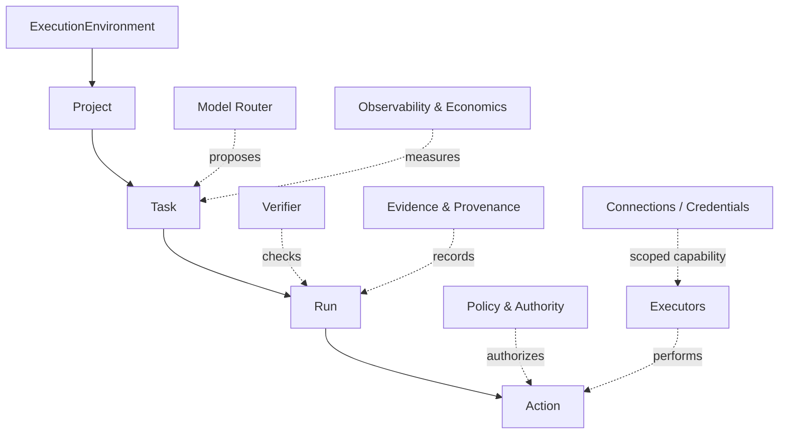
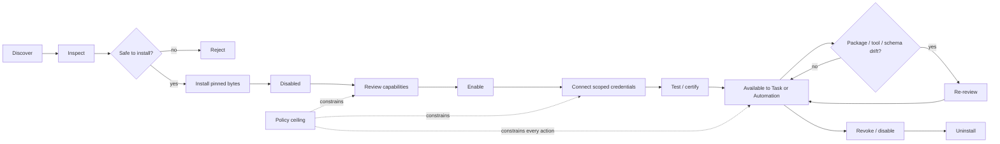
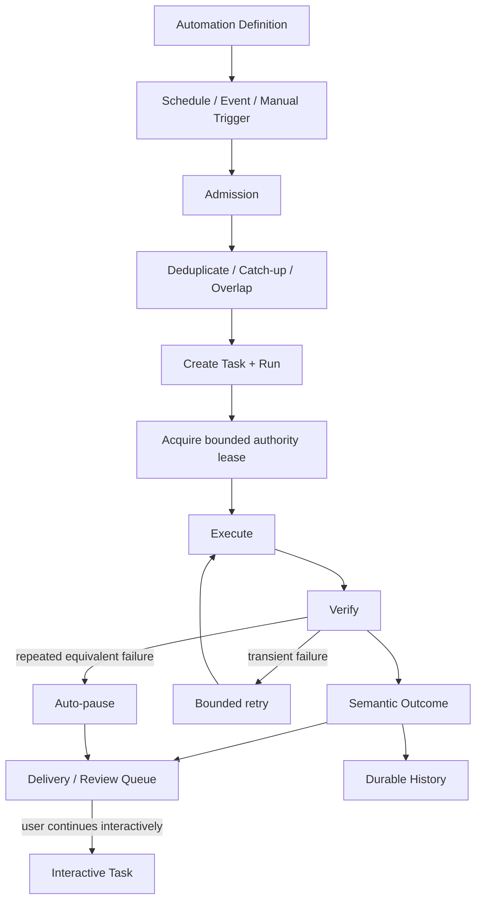

# Lumi Agents Market-Winning Product Strategy and Feature Blueprint

## Executive summary

### The central conclusion

Lumi should **not** try to win by becoming “another coding agent with more features.” That battlefield is already converging rapidly. Codex, Claude Code/Cowork, Cursor, GitHub Copilot, Zed, T3 Code, and OpenClaw increasingly share the same primitives: projects, parallel/background agents, skills, MCP, automations, remote supervision, Git integration, permissions, and review surfaces. Codex already combines project threads, worktrees, Skills, Automations, review queues, sandboxing, and desktop/mobile supervision; Cursor now has cloud agents and event/schedule-driven Automations; Claude spans Code, Cowork, desktop/web/mobile, connectors, plugins and scheduled work; GitHub increasingly acts as a multi-agent distribution and governance layer; Zed is turning ACP into an interoperable agent/editor ecosystem. citeturn0search0turn0search2turn8search14turn2search0turn7search2turn17search0

The stronger strategic position is:

> **Lumi = the trusted operating system for delegated digital work.**
>
> Open a Project, delegate an outcome, let agents work across files/apps/services, verify what actually happened, preserve provenance, automate what becomes repeatable, and eventually package proven work into bounded operational responsibilities.

That is already latent in Lumi's architecture. The current specs define the chain:

> **Models propose → policy authorizes → executors act → verifiers determine outcome → evidence records → economics measures value.**

They also distinguish Work mode, durable Projects, hardened Workflow Packs, and eventually Role Packs. This is strategically stronger than centering the company on chat or code generation. fileciteturn4file0

The most important market fact is not that developers lack AI tools. It is that **trust is failing to keep pace with adoption**. Stack Overflow's 2025 survey found AI use widespread while trust in accuracy fell sharply; “almost right” output and the debugging work it creates are major frustrations. citeturn11search3turn11search10 Meanwhile, enterprise AI spending reached an estimated $37 billion in 2025, with coding the largest departmental AI category at about $4 billion, and Menlo estimates 27% of AI application spending is already driven through product-led adoption rather than centralized purchasing. citeturn13search0

That creates Lumi's opening:

> **Don't sell more intelligence. Sell trustworthy delegation.**

### The three layers Lumi needs to win

I would organize virtually the entire product around three increasingly valuable loops:

```text
WORK
"Do this meaningful thing."
        ↓
Project → Task → Run → verified result
        ↓
AUTOMATE
"Do this whenever X happens."
        ↓
Automation → repeated verified runs
        ↓
OPERATE
"Own this bounded responsibility."
        ↓
Workflow Packs → Role Pack → measurable business outcome
```

**Work** creates adoption.

**Automations** create retention.

**Verified operational ownership** creates economic differentiation and defensibility.

The current Lumi specification suite is already unusually aligned with this model: Project/workspace semantics, durable Tasks/Runs, policy, evidence, Workflow Packs, scheduler, Automations, Skills/Plugins, project connections, and documents are all explicitly specified. fileciteturn3file0

The problem is execution, not conceptual scope. The repository's own readiness assessment remains **NO-GO** for V1 release and unattended customer operation. Folder-as-Project has substantial deterministic coverage, but live desktop dogfood, model-driven planning, Automations' complete vertical slice, extension/connection integration, real executor proof, signed distribution, and real workflow economics remain incomplete. fileciteturn5file0

### What I would protect from feature creep

The strongest opposing argument is serious:

> OpenAI, Anthropic, Microsoft/GitHub and Cursor have distribution, models, capital, enterprise relationships and increasingly complete agent platforms. A small independent product that merely recreates their UI and tools will likely be bundled away.

I agree.

Therefore **feature parity is necessary only at the delegation layer, not sufficient for strategy**.

Lumi should reach parity on the capabilities users expect—Projects, Tasks, Git, shell, changes, Automations, Skills, connectors, remote supervision—but make its differentiated investment in:

1. **Verified completion rather than agent self-report.**
2. **Explicit authority and reversible execution.**
3. **Change and side-effect provenance.**
4. **Durable work that survives process/model/device boundaries.**
5. **Provider- and executor-neutral routing.**
6. **Project → Automation → Workflow conversion.**
7. **Measured human-attention and economic displacement.**
8. **Portable skills/plugins/connectors instead of proprietary lock-in.**
9. **Regression learning from every real-world failure.**
10. **Role Packs for bounded responsibilities where Lumi can prove operational value.**

This thesis is strengthened by current autonomy research. METR's 2026 frontier evaluation estimated roughly a 12-hour 50%-reliability task horizon but only about a 1.5-hour 80%-reliability horizon on its task distribution; it also emphasizes that “time horizon” measures task difficulty, not how long an agent can literally be left running. The implication is that longer autonomy is becoming possible, but **checkpoints, verification, recovery and decomposition remain fundamental product infrastructure**. citeturn11search4turn11search8

### Recommended market position

| Dimension | Recommendation |
|---|---|
| Category | Trusted agentic workspace + digital-work operating layer |
| Initial wedge | Technical power users and small teams doing substantial project work |
| Retention wedge | Project-native Automations |
| Business expansion | Bounded Finance/Ads/IT/other operational Workflow and Role Packs |
| UX | Desktop-first delegation; web/mobile supervision |
| Model strategy | Multi-provider, model-neutral |
| Integration strategy | MCP + Agent Skills + ACP + native Lumi capabilities |
| Security strategy | Capability/policy authority, brokered credentials, sandboxed execution |
| Differentiation | Verification, evidence, recovery, economics |
| Distribution | PLG + open protocols + project portability + founder-led design partners |
| Enterprise | Governance/control plane after the single-user work loop is excellent |
| Marketplace | Private/curated first; public only after provenance and sandboxing are proven |
| Absolute budget | **Unspecified** |
| Headcount | **Unspecified** |
| Roadmap dates | Planning ranges below, **not commitments** |

My confidence is **high** on the product architecture and table stakes, **medium-high** on the differentiation thesis, and **medium** on monetization/GTM sequencing because actual willingness-to-pay and deployment/support economics have not yet been observed in independent Lumi customers.

## Market and competitive landscape

### The market is moving from assistant to delegated work

Three trends matter more than individual model benchmarks.

First, **coding has become the first large commercial agentic category**. Menlo estimates $4 billion of 2025 enterprise AI application spending went to coding, while enterprise buyers increasingly purchased rather than internally built AI solutions. citeturn13search0

Second, adoption is increasingly **bottom-up**. Menlo estimates PLG accounts for 27% of AI application spending, considerably higher than its estimate for conventional SaaS, which strongly favors products that a founder or engineer can install, prove valuable, and later expand organizationally. citeturn13search0

Third, agent capabilities are commoditizing faster than trust. The same feature—background agents—is already present in Codex, Claude, Cursor, GitHub and others, while security research continues to show meaningful indirect-prompt-injection and data-exfiltration vulnerabilities in tool-using agents. citeturn0search0turn8search0turn7search14turn11academia24turn11academia26

That argues against Lumi competing on “our agent is smartest.”

### Target users and personas

I would deliberately separate **adoption personas** from **economic buyers**.

| Persona | Primary job | What wins them | What causes rejection |
|---|---|---|---|
| Technical founder / power user | Delegate substantial repository, research, document and operations work | Open Folder, fast execution, strong models, shell/Git, transparent changes, Automations | Slow UI, constant approvals, generic chat, model lock-in |
| Engineer / analyst | Hand off bounded tasks and review results | Accurate context, tests, diffs, artifacts, resume, familiar project model | “Almost-right” output that increases review burden |
| Team lead / manager | Increase throughput without losing control | Review queue, verified outcomes, cost/quality metrics, policies | Agent activity without proof of value |
| Operator | Delegate recurring work across business software | Browser/API connectors, Automations, reliable exception handling | Coding-centric product language, brittle browser scripts |
| Security / IT admin | Permit safe adoption | SSO/SCIM, policy, egress controls, audit, secrets, private extensions, revocation | Credentials in prompts, uncontrolled plugins, shadow agents |
| Extension/workflow builder | Package repeatable expertise | Skills, plugins, hooks, MCP, SDK/API, eval harness | Proprietary one-off formats |
| Executive buyer | Buy capacity/value, not prompts | Verified units of work, lower human minutes, predictable cost, auditability | “AI productivity” claims without measured baseline |

The first two are the best **PLG acquisition wedge**. Operators and managers are the best **economic expansion wedge**. Security becomes a buying gate once team deployment begins.

Trying to optimize the first release equally for all seven would be a mistake.

### Competitive maturity

The following scores are an **analyst assessment**, not vendor-provided rankings:

**3 = strong/mature capability, 2 = substantial, 1 = early/partial, 0 = not a central product capability.**

| Product | Project work | Parallel/background | Automations | Verification/review | Remote/mobile | Extensibility | Enterprise governance |
|---|---:|---:|---:|---:|---:|---:|---:|
| **Codex** citeturn0search0turn0search2turn1search2turn1search7 | 3 | 3 | 3 | 3 | 3 | 3 | 3 |
| **Claude Code / Cowork** citeturn2search0turn3search0turn3search1turn19search5 | 3 | 3 | 3 | 2 | 3 | 3 | 3 |
| **Cursor** citeturn8search0turn8search14turn8search16 | 3 | 3 | 3 | 2 | 2 | 3 | 3 |
| **GitHub Copilot / Agent HQ** citeturn7search0turn7search14turn7search8turn7search12 | 3 | 3 | 2 | 3 | 3 | 3 | 3 |
| **Zed** citeturn5search0turn5search5turn5search7turn17search0 | 3 | 3 | 1 | 3 | 2 | 3 | 2 |
| **T3 Code** fileciteturn7file0 | 2 | 3 | 1 | 2 | 3 | 2 | 1 |
| **OpenClaw** citeturn6search0turn6search1turn6search9turn6search10 | 1 | 2 | 3 | 2 | 3 | 3 | 1–2 |
| **Lumi today** fileciteturn5file0 | 2 | 1–2 | 1 | 2 | 1 | 1 | 1–2 |
| **Lumi target** fileciteturn3file0 | 3 | 3 | 3 | **3+** | 3 | 3 | **3+** |

The point is not that Lumi must maximize every score. It should be **good enough everywhere users expect interoperability, and conspicuously better on verification, policy, recovery and operational evidence.**

### Important competitor lessons

**Codex:** integrated worktrees and parallel threads reduce the cost of delegating multiple tasks; Automations feed a review queue instead of behaving like invisible cron; remote supervision preserves host-side files and credentials. Those three patterns should be considered table stakes. citeturn0search0turn0search2turn1search7

**Claude:** capabilities follow users across desktop/web/mobile, while connectors, MCP and project memory make the agent useful beyond code. Anthropic also exposes increasingly sophisticated enterprise controls, including SCIM, audit logs, retention controls, Compliance APIs and customer-managed encryption keys. citeturn2search0turn3search1turn19search0turn19search5

**Cursor:** the market is already moving from “coding automation” to general organizational Automations; Cursor now supports scheduled/event-driven agents, multiple repositories and even no-repository workflows. citeturn8search14turn8search16 This validates Lumi's decision to treat Project and Automation as related but distinct abstractions.

**Zed:** ACP may become strategically important because it decouples agents from their UI hosts. Zed says ACP now spans its own editor, JetBrains, other clients and numerous agent implementations; the protocol is Apache-licensed. citeturn17search0turn17search1turn17search2 Lumi should strongly consider being both an **ACP-capable agent** and eventually an **ACP client/control surface**.

**T3 Code:** its key insight is not agent intelligence but the control surface: reuse authenticated agents already installed on the user's computer and supervise them via desktop, web and mobile. It explicitly supports multiple provider harnesses and emphasizes remote control. fileciteturn7file0 This is a powerful warning against Lumi reimplementing every provider's agent runtime.

**OpenClaw:** it demonstrates the value of treating the scheduler, background-run ledger, workflows and skills/plugins as separate concerns rather than turning everything into a chat session. citeturn6search1turn6search10

### Pricing competition

Current pricing also shows that **$20-ish individual entry tiers and higher usage tiers are becoming familiar**, with enterprise monetization increasingly combining seat access, AI usage and governance.

| Product | Representative current pricing |
|---|---|
| OpenAI Business | Standard seat $20/month annually ($25 monthly); premium seat $100 annually ($125 monthly). citeturn9search1turn9search8 |
| Cursor | Pro $20, Pro+ $60, Ultra $200; Teams $40/user/month. citeturn8search1turn8search7 |
| GitHub Copilot | Pro $10, Pro+ $39, Max $100; Business $19 and Enterprise $39 per seat/month. citeturn9search0turn9search3turn9search14 |
| Claude | Pro $20; Max $100/$200; Team $25/member/month annual or $30 monthly; Enterprise adds separately metered usage. citeturn10search1turn10search12turn10search7 |
| Zed | Personal free, Pro $10, Business $30/seat/month. citeturn10search0 |

This suggests Lumi should **not depend on arbitraging model tokens** as its primary margin source. Provider pricing is transparent and volatile, and users increasingly expect model choice.

## Product architecture and winning feature set

### Canonical architecture

The hierarchy Lumi has chosen is correct and should become visible throughout the product:



The Project must remain a durable context/workspace, not a permission source. Tasks remain goals. Runs are attempts/executions. Actions are concrete side effects. The existing Lumi specs already encode those distinctions and explicitly prevent repository instructions from widening authority. fileciteturn3file0

### Core feature portfolio

The table below is the set I would treat as the **full market-winning capability map**. “Acceptance” is deliberately outcome-oriented.

| Capability | Problem / user story | Acceptance criteria | Complexity | Dependencies | Main security/privacy risk | Accelerators |
|---|---|---|---|---|---|---|
| **Folder-as-Project** | “Open my real folder and work safely in it.” | Durable identity; Recent Projects; dirty-tree preservation; no root escape; external-edit conflicts detected; restart works | High | State, filesystem policy | Path/symlink escape, clobbering work | Existing Lumi Project implementation; Tauri |
| **Goal-oriented Task/Run** | “I specify the outcome, not every tool call.” | Task has goal, status, budget, Project, Run history, cancellation and visible progress | High | Domain/state/model router | Goal drift; hidden side effects | Existing Lumi state/orchestrator |
| **Parallel delegated work** | “Run several tasks without corrupting my branch.” | Independent runs/worktrees; concurrency/resource controls; inspectable ownership | High | Project, Git, scheduler | Race conditions, conflicting writes | Git worktrees; bounded subagents |
| **Changes & checkpoints** | “Show me exactly what Lumi—not I—changed.” | Before/after refs; Lumi-only diff; restore/checkpoint; external change attribution | High | Files/Git/state | False provenance | Existing change-set primitives |
| **Verification & evidence** | “Don't tell me it worked—prove it.” | Declared postconditions; test/build/business verifier; success impossible without required proof | High | Executors, artifacts | Forged/stale evidence | Lumi verifier/evidence specs |
| **Durable resume/recovery** | “Crash, restart or switch devices without losing intent.” | Persisted intent; ambiguous side effects re-observed; no blind replay; correct Project/workspace restored | High | Durable state | Duplicate external action | Existing replay/recovery architecture |
| **Project search/context/memory** | “Understand this repository without loading everything.” | Bounded search; source attribution; stale-memory invalidation; no whole-disk indexing | Medium | Project/discovery | Sensitive-content leakage | Local search/index; Project memory |
| **Multi-model routing** | “Use the right model/provider without rewriting the workflow.” | Provider-neutral contracts; privacy envelope preserved; capability/fallback rules; spend budgets | High | Model adapters | Egress/data residency drift | Provider adapters; BYO API/subscription where allowed |
| **Execution environments** | “Work locally, remotely or in cloud isolation.” | Capability negotiation; environment identity; local/cloud/private runner; explicit filesystem/credential ownership | High | Device identity | Confused deputy, remote/local path confusion | Tauri + OCI/private runners |
| **Shell & code execution** | “Build, test and manipulate my project.” | cwd binding; timeout; cancellation; resource/network policy; bounded output | High | Sandbox/policy | RCE/exfiltration | Existing lumi-workspaces |
| **Git + CI/CD** | “Use the same engineering workflow my team already trusts.” | status/diff/branch/commit; PR integration; CI results; remote writes separately gated | High | Connections, Git | Push/force-push, credential theft | Git CLI/API; GitHub/GitLab connectors |
| **Browser/API/native execution** | “Do work across the software my company already uses.” | Prefer API → semantic browser/native → vision; verified account/target; recovery from ambiguous effects | Very high | Executors/connections | Prompt injection, wrong tenant, data exfiltration | Existing Playwright worker; MCP/connectors |
| **Document Workspace** | “Inspect/edit docs, sheets, slides and artifacts without leaving Lumi.” | Local preview; safe-save; preservation testing; external-editor fallback | High | Project/artifacts | Active content, format loss | Existing Spec 30 research |
| **Automations** | “Do this on a schedule or when an event happens.” | Persistent triggers; dedup; leases; overlap/catch-up/retry; History; Review Queue; auto-pause | High | Scheduler/task runtime | Unattended privilege escalation | Existing `lumi-scheduler` |
| **Connections & credential broker** | “Connect Slack/GitHub/Ads/etc. without giving every plugin my token.” | OS/vault secret storage; scoped broker calls; revocation; project binding | High | Policy/identity | Secret exfiltration | OAuth/OIDC; MCP auth; OS keychains |
| **Skills** | “Teach Lumi reusable procedures inside the Project.” | Portable SKILL.md; progressive discovery; versioning; no authority gain | Medium | Context/extensions | Malicious instructions/scripts | Agent Skills open format citeturn15search8 |
| **Plugins/hooks/commands** | “Package actual executable capabilities.” | Install ≠ enable ≠ authenticate; exact hashes; permission review; sandbox; uninstall/revoke | Very high | Policy/sandbox/connectors | Supply-chain compromise | Lumi Spec 14/28; MCP |
| **MCP interoperability** | “Use the expanding tool ecosystem.” | Current protocol, typed tool mapping, OAuth, version pinning, drift review | Medium-high | Connectors/policy | Tool poisoning/token misuse | MCP 2026-07-28 citeturn16search6 |
| **ACP interoperability** | “Use Lumi from other IDEs—or control other agents from Lumi.” | Lumi agent endpoint works with ≥2 ACP clients; optional external-agent client mode | Medium-high | Agent protocol | External agent authority mismatch | ACP ecosystem citeturn17search0 |
| **Remote supervision** | “Check, steer or approve work from my phone.” | Activity/diff/evidence/approval sync; host files/secrets never implicitly copied | High | Control plane/device | Remote impersonation, data sync | Codex/T3 pattern citeturn0search2 fileciteturn7file0 |
| **Review/approval inbox** | “Show me only the things requiring judgment.” | Unified Review Queue; exact-action approvals; change review; unread ≠ approved | Medium-high | Evidence/policy | Approval fatigue | Existing Lumi automation design |
| **APIs/CLI/SDK** | “Integrate Lumi into our systems.” | typed API; webhook/events; task create/status/cancel; evidence/artifacts; SDK version contract | High | Control plane | Programmatic authority bypass | MCP/ACP/own stable protocol |
| **Observability/economics** | “Tell me whether agents save time and money.” | run/action traces; cost; latency; rescue; verified completion; human minutes; no surveillance | Medium-high | All runtime layers | Sensitive telemetry | OpenTelemetry citeturn20search9 |
| **Enterprise admin** | “Deploy this safely to hundreds of people.” | SSO, SCIM, RBAC/ABAC, MDM, device revocation, private extension policy, retention, audit export | Very high | Identity/control plane | Cross-tenant leaks/admin abuse | Tauri, IdP, SIEM |
| **Accessibility/localization** | “Use Lumi comfortably across markets and abilities.” | Keyboard-first; screen readers; locale-aware date/time/number; externalized strings; timezone-safe schedules | Medium | Design foundation | Locale/timezone execution error | React i18n layer; semantic HTML |
| **Workflow/Role Packs** | “Own this recurring business responsibility reliably.” | versioned workflow; policy; postconditions; regression corpus; economics; exception contract | Very high | Almost all above | Over-autonomy/business harm | Lumi's existing Workflow Pack model |

This is a lot of surface area, but it is **not** one release. It is the destination map.

### The highest-value feature is not “multi-agent”

Parallel agents look impressive and are increasingly common. Codex, Zed, Cursor, GitHub and T3 all make parallel/background work increasingly accessible. citeturn0search0turn5search5turn8search0turn7search14

The more durable differentiator is:

```text
Task intent
   ↓
specific actions
   ↓
specific side effects
   ↓
specific verification
   ↓
specific evidence
   ↓
measured useful outcome
```

This should become Lumi's internal **provenance graph**.

For a coding task, that graph might be:

```text
"Fix auth bug"
   ↓
files 4, 8, 11 modified
   ↓
commit abc123
   ↓
unit + integration + lint pass
   ↓
PR #481
   ↓
CI green
```

For Ads Ops:

```text
"Review campaign health"
   ↓
Meta account X observed
   ↓
spend / CTR / CPA snapshot
   ↓
3 anomalies
   ↓
2 recommendations
   ↓
no external write
   ↓
report + evidence
```

That data becomes tremendously valuable for evaluation, regression learning, customer trust and eventually pricing.

### Testing should move beyond headline benchmarks

External benchmarks still have value, but benchmark chasing cannot be the quality system. OpenAI now explicitly recommends moving away from SWE-bench Verified for frontier capability measurement because it found increasing contamination and recommends SWE-bench Pro instead. citeturn12search5 Research has also shown that insufficient tests can misclassify erroneous SWE-bench patches as successful, reinforcing the importance of strong verification oracles. citeturn11academia25

Lumi's primary eval hierarchy should therefore remain:

```text
unit/contract
↓
deterministic hostile fixtures
↓
real repository/application fixtures
↓
provider × model × OS × executor matrix
↓
canary/shadow runs
↓
real customer work
↓
escaped failure → permanent regression
```

That matches Lumi's existing evaluation specification, which already calls for unit, deterministic executor, workflow, model/provider, OS/browser, adversarial, recovery and real workflow outcome evaluation. fileciteturn11file0

## Trust, extensibility, execution and platform architecture

### Trust should be the product, not a security appendix

Security research gives a fairly clear warning: when an agent consumes untrusted external content and also has powerful tools, prompt injection becomes an authorization problem rather than merely a prompt-engineering problem. AgentDojo-related research has demonstrated non-trivial attack success and utility degradation under injection, while newer work continues to find existing defenses inadequate for more dynamic real-world scenarios. citeturn11academia24turn11academia26

Cursor's own documentation makes the trade-off explicit: its background agents operate in remote VMs, have internet access and auto-run terminal commands, and Cursor warns that this increases data-exfiltration risk through prompt injection. citeturn8search0

OpenAI and Zed have consequently moved significant agent execution behind OS-enforced sandboxing and granular filesystem/network controls. citeturn1search2turn5search7

Lumi is directionally right to treat:

```text
instruction
≠
authority
```

and:

```text
installation
≠
activation
≠
credential access
≠
execution authority
```

Those principles are already explicit in Specs 14, 28 and 29. fileciteturn9file0 fileciteturn3file0

### Recommended authority stack

```text
Organization policy ceiling
          ∩
User authority
          ∩
ExecutionEnvironment capability
          ∩
Project scope
          ∩
Task / Automation lease
          ∩
Plugin / connector declaration
          ∩
Action-specific approval
          =
Effective action authority
```

No prompt, Skill, README, webpage or plugin response should be allowed to increase any set in that intersection.

A policy engine such as **Cedar** is worth evaluating as either an implementation component or a semantic reference because it cleanly separates authorization policy from application logic and evaluates principal/action/resource/context requests with deny semantics. citeturn20search0turn20search3 I would **not** rewrite `lumi-policy` merely to adopt it; migration is justified only if Cedar materially reduces policy bugs or makes enterprise administration easier.

### Credential architecture

Lumi should continue with the position already specified:

> Credentials may be **associated with a Project**, but actual secrets should not live in the project checkout.

MCP's authorization evolution reinforces this direction. Its modern protocol has tightened OAuth/OIDC semantics, and enterprise-managed authorization is now specifically addressing centrally provisioned access. citeturn16search1turn16search6

The correct model is:

```text
Project
└── requires "Meta Ads read access"
       ↓
opaque Connection ID
       ↓
trusted credential broker
       ↓
policy verifies:
    Project
    Task
    plugin/connector
    account
    action
    audience
    destination
       ↓
connector performs operation
```

Prefer:

> `connector.read_campaigns(connection_ref)`

over:

> “here is the Facebook token, plugin; be careful.”

### Plugin and Skill lifecycle



The Agent Skills specification is a strong compatibility target because it defines Skills as directories containing `SKILL.md`, optionally alongside scripts, references and assets. citeturn15search8

But Skill metadata must never become Lumi authorization. Lumi's existing extension spec correctly says Skills provide procedural/model context and do not grant authority. fileciteturn9file0

### Open standards should be strategic, not merely technical

Lumi should embrace four layers:

| Standard | Lumi role |
|---|---|
| **Agent Skills** | Portable reusable procedural knowledge |
| **MCP** | Tools/resources/connectors |
| **ACP** | Agent ↔ editor/control-surface interoperability |
| **Lumi protocols** | Verified Task/Run/Action, policy, evidence and operational semantics |

MCP's July 2026 specification moved toward a stateless HTTP-native core and explicit extensions, making it increasingly suitable for scalable tool integration. citeturn16search6 ACP has acquired material ecosystem support across agents and editors and is explicitly designed to separate the agent from its UI client. citeturn17search0turn17search1

The non-consensus strategic implication is:

> **Interoperability can be a moat when the proprietary value sits one layer above it.**

Lumi should not fight to own every tool protocol. It should own **safe delegated outcome execution and verified operational memory**.

### Recommended platform components

| Layer | Direction |
|---|---|
| Desktop | **Tauri v2**, already chosen by Lumi. Its capability/runtime-authority model allows commands and scopes to be limited per WebView/window; its updater requires signed updates. citeturn14search0turn14search2turn14search3 |
| Durable local state | **SQLite**, but pin a patched release. SQLite documented a rare WAL-reset corruption bug fixed in 3.51.3 and selected backports; do not ship a vulnerable bundled version. citeturn20search1 |
| Authorization | Existing Lumi policy engine; evaluate **Cedar** where ABAC/RBAC administration becomes difficult. citeturn20search0 |
| Telemetry | **OpenTelemetry** with Lumi-specific Task/Run/Action semantics and privacy redaction; OTel maintains GenAI semantic conventions. citeturn20search9 |
| Tool ecosystem | **MCP 2026-07-28** compatibility. citeturn16search6 |
| Agent UI interoperability | **ACP**. citeturn17search0 |
| Procedural extensions | **Agent Skills / SKILL.md** compatibility. citeturn15search8 |
| Browser | Continue Lumi's semantic-browser/Playwright path rather than building a browser engine; the current repository already includes a Playwright worker. fileciteturn5file0 |
| Secrets | OS-protected stores locally; managed vault/IdP integration for enterprise; never plaintext repository credentials. fileciteturn3file0 |

### Security corpus required before unattended scale

Every release should continuously attack:

- prompt injection from webpages, repositories, documents and MCP responses;
- path traversal, symlink/junction escape and workspace confusion;
- secret-reference guessing;
- plugin update capability drift;
- stale approvals;
- cross-project and cross-tenant confused-deputy attacks;
- duplicate side effects after crash;
- wrong-account/wrong-window actions;
- malicious OAuth/MCP endpoint substitution;
- model fallback violating data policy;
- automation retry amplification;
- remote-supervision identity substitution;
- stale external-file writes;
- supply-chain package replacement;
- evidence tampering.

The key metric is not “number of blocked attacks.”

It is:

> **zero unauthorized side effects on the certified matrix.**

That standard already exists in Lumi's roadmap and eval specification. fileciteturn4file0 fileciteturn11file0

## Experience, automation and design system

### Desktop should be the operating console, not another IDE

The Lumi desktop spec is already conceptually correct: onboarding, Projects, tasks, progress, approvals, exceptions, evidence, provider settings, privacy indicators, emergency stop and device registration belong in the desktop app, while policy authority remains outside UI state. fileciteturn10file0

I would structure the primary navigation as:

```text
LUMI

Work
  Projects
  Tasks

Operate
  Automations
  Review Queue

Capabilities
  Skills & Plugins
  Connections

Organization
  Activity
  Insights
  Settings
```

Not:

```text
Chat
Chat
More Chat
Agents
AI Settings
```

### Project home

The Project page should immediately answer:

```text
What is this?
What is Lumi doing?
What changed?
What needs me?
What has been proven?
What happens next?
```

A conceptual composition:

```text
┌──────────────────────────────────────────────────────────────────┐
│ PrintUp                                    main · 3 local changes │
│ ~/Projects/printup                        Runtime: This Mac      │
├──────────────────────────────────────────────────────────────────┤
│                                                                  │
│  Ask Lumi to work on this project...                      [Run]  │
│                                                                  │
├──────────────────────┬───────────────────────────────────────────┤
│ Active               │ Changes                                  │
│                      │                                           │
│ OAuth migration      │  6 files changed                          │
│ ● Running            │  +218  -73                               │
│ Running tests...     │                                           │
│                      │  ✓ typecheck                              │
│                      │  ✓ unit tests                             │
│                      │  ● integration tests                      │
├──────────────────────┴───────────────────────────────────────────┤
│ Recent work                      Automations                     │
│ Upgrade mobile architecture      Daily regression review         │
│ Fix invoice export               Dependency watch                │
└──────────────────────────────────────────────────────────────────┘
```

The biggest UX mistake would be showing raw chain-of-thought or hundreds of tool calls.

Show **operational progress**:

```text
Understanding project
Editing authentication flow
Running integration tests
2 tests failed
Correcting callback handling
Validation passed
Ready for review
```

### Task detail should be evidence-first

```text
TASK
Implement OAuth login

STATUS
Ready for review

OUTCOME
✓ Login works in test environment
✓ 47 tests passed
✓ Typecheck passed

CHANGES
8 files · +384 / -107

EVIDENCE
Git diff
Test results
Browser recording
Generated migration

ATTENTION
None

COST
$1.84 · 11m 42s

[Review changes]   [Continue]   [Create automation]
```

The final button matters.

**“Create automation from this”** should become a signature Lumi transition.

### Automation lifecycle



This is stronger than ordinary cron because **scheduling is not authority**.

Cursor's current product direction confirms that scheduled and event-based agent work is becoming expected, including triggers from GitHub, GitLab, Slack, Linear and webhooks. citeturn8search14 OpenClaw likewise separates durable scheduler/run semantics from other forms of workflow/background processing. citeturn6search1turn6search10

### Global Automations and Project Automations

Keep the design you just specified:

```text
Global Automations
    ↓ same records
Project Automations
```

Global view:

```text
AUTOMATIONS

Search automations...

All   Active   Paused   Completed     Needs attention

PROJECT          AUTOMATION                WHEN            NEXT
Ads Agents       Intraday Health           Every 4h        43m
Lumi Agents      Regression Review         Daily 09:00     12h
PrintUp          Dependency Watch          Monday          3d
Finance Ops      Invoice Reconciliation    Weekdays        16h
```

Project view:

```text
PRINTUP / AUTOMATIONS

Dependency Watch
Daily Regression Review
Weekly Release Readiness
```

They must be the same identities and histories, not copied schedule configurations. That principle is already in Lumi's specification suite. fileciteturn3file0

### Review Queue is potentially more important than notifications

Agents that run continuously can easily create a second job: **reviewing the agents**.

Lumi should aggressively distinguish:

```text
NO_ALERT
NO_ACTION
VERIFIED_ROUTINE
```

from:

```text
NEEDS_DECISION
BLOCKED
INCIDENT
APPROVAL_REQUIRED
VERIFICATION_FAILED
```

The user's attention should be spent on the second set.

This aligns with Lumi's existing goal to measure unexpected rescue separately from expected approval. fileciteturn11file0

### Web and mobile should begin as supervision surfaces

Do not initially rebuild the full desktop product on mobile.

Remote should excel at:

```text
See active work
See outcome
Review diff/report
Approve or reject
Answer question
Pause/stop
Redirect
Resume
```

Codex now explicitly supports supervising host-based work from mobile while leaving local files, credentials and permissions with the host machine, and T3 similarly treats mobile/web as a control surface over agents running elsewhere. citeturn0search2 fileciteturn7file0

That is the right architecture for Lumi.

### Lumi Glyphs

The icon language should continue the direction already established:

**Tabler geometry as a donor source, Lumi-native glyphs for strategic concepts.**

The Design System specifies restrained geometric line icons, roughly 1.75–2px strokes and four recurring motifs: the folded/L-corner for structure, diagonal channel, annotation dot for evidence/source, and rare four-point clarity mark for verified/clarified insight. fileciteturn0file0

Custom glyphs deserve investment for:

```text
Project
Task
Agent
Automation
Workflow
Evidence
Verification
Approval
Connection
Skill
Plugin
Handoff
Recovery
Authority
Review Queue
Role Pack
```

Generic actions remain commodity:

```text
Search
Add
Close
Refresh
Download
Settings
Chevron
Calendar
Filter
```

Avoid robot heads, brains, “AI sparkle everywhere,” and decorative icon density.

The UI should communicate **competence, evidence and calm**, not AI excitement.

## Business model, GTM, enterprise and defensibility

### Monetization

I recommend four commercial layers.

#### Local

```text
$0
```

Purpose:

- Open Folder / Projects
- local runtime
- basic Tasks
- BYO supported provider credentials/subscription where vendor terms permit
- community Skills
- limited Automations
- Git/files/shell
- local evidence

The purpose is adoption and trust, not revenue extraction.

Zed already allows unlimited external-agent/BYO-key usage in its free Personal tier, while T3 Code presents itself as open and freely available; Lumi will face resistance if basic local delegation is locked behind an expensive subscription. citeturn10search0 fileciteturn7file0

#### Pro

**Pricing hypothesis: roughly the prevailing $20–30/month category anchor, plus transparent model/cloud usage where applicable.**

Differentiators:

- unlimited Projects
- richer Automations
- remote supervision
- cloud/private runners
- advanced evidence/history
- provider routing
- higher execution limits

This range is a **recommendation**, not observed Lumi willingness-to-pay.

#### Team

**Pricing hypothesis: approximately $30–50/user/month plus shared compute/usage.**

Add:

- team policies
- shared/private Skills and Plugins
- project sharing
- pooled usage/budgets
- organization Automations
- review routing
- admin analytics
- Git/Slack/issue-tracker connectors

The competitive seat anchors make this range plausible, but Lumi should validate it rather than infer willingness-to-pay from competitors. citeturn8search7turn9search3turn10search0

#### Enterprise / Operations

Custom pricing for:

- SSO/SCIM
- private networking/runners
- data residency
- audit/SIEM
- retention
- MDM
- legal/compliance package
- SLA/support
- private extension governance
- Role Packs

For Role Packs, I would **not** price purely by seat.

Eventually use:

```text
platform fee
+
included verified work units
+
usage above allowance
```

and anchor the price to the customer's **measured value**, not token consumption.

Avoid a naïve “pay only when agent acts” structure because it creates bad incentives toward more actions.

### Outcome economics

The strongest Lumi commercial metric already exists in the repo:

```text
cost_per_verified_successful_workflow
```

The existing spec also tracks baseline manual minutes, residual human minutes, runtime cost, support cost and implementation cost. fileciteturn11file0

I would add:

```text
verified_value_per_human_attention_minute
```

because the scarce resource in agent-heavy organizations may increasingly be **human judgment**, not tokens.

### GTM

The best GTM is a two-engine model.

#### Developer/product-led engine

Use Lumi Work mode to land with individual builders:

```text
Install
→ Open real Project
→ complete meaningful task
→ see evidence
→ create second task
→ create Automation
→ invite collaborator
```

Menlo's finding that AI application adoption is unusually PLG-heavy supports this direction. citeturn13search0

Distribution should include:

- GitHub;
- Agent Skills compatibility;
- ACP compatibility;
- MCP ecosystem;
- high-quality open examples;
- reproducible benchmark/regression repositories;
- import from Claude/Codex/Cursor conventions where safe.

Do **not** make “switch away from Codex/Claude” the pitch.

Make the pitch:

> **Bring the models and agents you already use. Lumi makes their work durable, controllable and verifiable.**

#### Founder-led operational engine

For Role Packs:

```text
10–30 tightly targeted prospects
→ workflow interview
→ observe real queue
→ baseline human time
→ paid bounded pilot
→ 100 representative runs
→ quantify rescue and economics
→ decide continue/stop
```

Do not hire a large enterprise sales organization before this works.

The current Lumi roadmap already contains the right evidence gate: one real workflow, at least roughly 100 representative runs, measured baseline/residual effort, verified outputs and exceptions before expanding the responsibility. fileciteturn4file0

### Defensibility

The defensible assets are not prompts.

#### Verified work graph

A proprietary corpus linking:

```text
goal
→ context
→ model
→ plan
→ actions
→ failures
→ verifier
→ outcome
→ human intervention
```

Over time this supports superior routing, reliability prediction and automation conversion.

#### Regression memory

Every production failure becomes an executable fixture.

Competitors can reproduce a feature.

It is much harder to reproduce years of:

```text
"these exact conditions caused this exact workflow to fail,
and this deterministic check now catches it"
```

#### Authority graph

Project + actor + device + plugin + connection + account + action + policy + evidence creates a powerful enterprise control primitive.

#### Workflow deployment IP

The valuable vertical asset is not “a Finance prompt.”

It is:

```text
workflow
+ connectors
+ exception taxonomy
+ policy
+ validation
+ deployment recipe
+ regression corpus
+ benchmarks
+ operating economics
```

#### Interoperability

Counterintuitively, supporting competitors through MCP/ACP/Skills increases Lumi's moat if Lumi owns the best **control and verification layer**.

A customer who can use Codex today, Claude tomorrow and another agent next year without rebuilding operational governance has less reason to replace Lumi.

### Enterprise requirements

The minimum serious enterprise package eventually needs:

| Area | Required capability |
|---|---|
| Identity | SAML/OIDC SSO, SCIM, domain verification |
| Authorization | RBAC + contextual/attribute policy |
| Device | registration, MDM deployment, revocation |
| Data | retention controls, deletion/export |
| Secrets | managed vault/broker, rotation, revocation |
| Network | proxy, allow/deny domains, private runners |
| Audit | export/API/SIEM streaming |
| AI governance | provider/model allowlist, data-egress policy |
| Extensions | private registry, origin/license/signature policy |
| Cost | budgets, user/project/workflow attribution |
| Compliance | DPA, subprocessors, security docs, SBOM |
| Resilience | signed updater, rollback, incident process |
| Privacy | local-only/privacy-sensitive modes |
| Residency | selected region / provider restrictions where needed |

These expectations are increasingly normal. OpenAI advertises SAML SSO, retention controls, enterprise audit/compliance capabilities and regional residency options; Anthropic Enterprise includes SCIM, audit logs, custom retention, Compliance/Analytics APIs, CMK and US-only inference. citeturn18search0turn18search8turn19search5

### Legal and compliance

This area needs jurisdiction-specific counsel before commercialization; the following is product planning, not legal advice.

The **EU AI Act is already materially relevant**. Its general application date was August 2, 2026, with an amended timetable that places many Annex III high-risk system rules from December 2027 and regulated-product high-risk rules from August 2028. Article 50 transparency requirements began applying August 2, 2026. citeturn21search0turn21search3turn21search9

Practical product implications:

- clearly identify AI interactions where required;
- preserve human accountability;
- log material agent actions;
- expose intended purpose and limitations;
- avoid silently drifting Role Packs into regulated/high-risk use cases;
- treat HR/employment decisions as especially sensitive;
- make data provenance/export/delete possible;
- maintain model/provider inventory;
- record material workflow versions;
- provide customer-configurable human-approval boundaries.

Lumi's current prohibition on arbitrary employee surveillance is strategically good and should remain explicit. fileciteturn3file0

For OSS and Plugins, every package should have:

```text
origin
exact version/hash
license
dependencies
known capability declarations
build provenance where possible
update source
```

Lumi already specifies license and provenance metadata for extensions and allows enterprise policy to block licenses/origins. fileciteturn9file0

### Performance and scalability

I would set explicit product budgets rather than optimize “fast” abstractly.

**Proposed targets**, not measured current performance:

| Operation | Target |
|---|---:|
| Warm desktop useful UI | <1.0 s |
| Cold desktop useful UI | <2.0 s |
| Open small/medium Project shell | <1.0 s before deeper discovery |
| Search first results | <200 ms local |
| User command acknowledgement | <100 ms |
| Progress/event UI update | <250 ms |
| Task cancellation acknowledgement | <500 ms |
| Resume ordinary local Task metadata | <3 s |
| Changes view for typical task | <500 ms |
| Approval page | <300 ms after data available |

Anything expensive should be:

```text
lazy
incremental
cancelable
bounded
cacheable
```

Do not block Project opening on semantic indexing.

For local state, SQLite remains attractive, but Lumi should ensure its bundled SQLite is at a version containing the 2026 WAL-reset fix if WAL is used with concurrent connections. citeturn20search1

For cloud connectors, adopting current MCP's stateless request model can reduce unnecessary session-state infrastructure, although Lumi's own Tasks/Runs still require durable application state. citeturn16search6

### Localization and accessibility

I would ship **English first** but make localization architectural from the beginning:

- no hardcoded strings;
- locale-aware numbers/currency/date;
- explicit timezone per Automation;
- DST test corpus;
- Unicode-safe search/path handling;
- CJK and Vietnamese typography checks;
- keyboard-first desktop behavior;
- screen-reader semantics;
- reduced-motion support;
- high contrast;
- RTL-capable layout primitives even if RTL translation ships later.

Vietnamese is an obvious early dogfood language, but internationalization should not delay the core verified-work loop.

## Roadmap, metrics and source priorities

### Priority by business value and effort

| Priority | Capability | Business impact | Effort | Why |
|---|---|---:|---:|---|
| **P0** | Real model-driven Project Task loop | Very high | High | Product must actually do substantial work |
| **P0** | Verification + evidence | Very high | High | Core differentiation |
| **P0** | Durable intent/recovery | Very high | High | Required for trustworthy autonomy |
| **P0** | Change provenance | Very high | Medium-high | Makes delegation reviewable |
| **P0** | Project Automations + global view | Very high | High | Converts utility into retention |
| **P0** | Git/shell/test validation | Very high | Medium-high | Coding/workflow table stakes |
| **P0** | Connection/secret boundary | Very high | High | Blocks unsafe extension growth |
| **P0** | Real desktop state, not fixture UI | Very high | Medium | Required to dogfood |
| **P0** | Regression/eval infrastructure | Very high | Medium-high | Compounding reliability asset |
| **P1** | Skills/Plugins | High | High | Ecosystem and repeatability |
| **P1** | MCP compatibility | High | Medium | Integration leverage |
| **P1** | Remote supervision | High | High | Retention and long-running delegation |
| **P1** | GitHub/Slack/issue integrations | High | Medium-high | Team distribution |
| **P1** | Team review/approvals | High | Medium | Multi-user adoption |
| **P1** | Admin/cost analytics | High | Medium | Expansion buyer |
| **P1** | Private/cloud runner | High | High | Enterprise and unattended work |
| **P1** | ACP agent support | Medium-high | Medium | Distribution/interoperability |
| **P1** | Document Workspace | Medium-high | High | Broadens Work beyond code |
| **P2** | Full enterprise control plane | Very high at scale | Very high | Premature before paid team use |
| **P2** | Curated/private marketplace | Medium-high | High | Useful only after extension safety |
| **P2** | Public marketplace | Medium | Very high | Supply-chain burden |
| **P2** | Multi-project/cross-project agents | Medium-high | Very high | Powerful but complex |
| **P2** | Broad Role Pack catalog | Potentially very high | Very high | Must follow one proven lighthouse |
| **P2** | Full mobile editing/runtime | Low-medium | Very high | Supervision delivers most value sooner |
| **Avoid** | Full IDE replacement | Low strategic value | Extreme | Competes on wrong axis |

### Market-proof phase

**Planning horizon: approximately the first three months if adequately staffed. Budget/headcount remain unspecified.**

Do almost nothing that doesn't strengthen this flow:

```text
Open real Project
→ delegate meaningful outcome
→ agent reasons
→ changes real environment
→ validates
→ shows evidence
→ user trusts result
→ restart
→ resume
```

Complete the repository's existing P0s first:

- durable-intent/replay repair;
- executor/artifact/approval boundaries;
- real dirty-repository desktop dogfood;
- model-driven planning;
- Automations vertical slice against `ads-agents`;
- project connections and extension boundary;
- signed/reliable desktop build pipeline preparation. fileciteturn5file0

**Exit thresholds I would use:**

| Metric | Threshold |
|---|---:|
| Unauthorized side effects | **0** |
| Verified completion on certified internal task matrix | ≥95% |
| Unexpected rescue | <5% on hardened routine slice |
| Project root escapes | 0 |
| Pre-existing-user-change loss | 0 |
| Crash-induced duplicate external effects | 0 |
| Real Project dogfood | ≥50 substantial tasks |
| Automation acceptance repo | ≥100 representative occurrences |
| Reproducible escaped failures added to regression suite | 100% |

Some of those align with Lumi's existing canary gates. fileciteturn4file0turn11file0

### Product-market phase

**Planning horizon: roughly the following three to six months, conditional on passing the preceding gates.**

Build:

- polished Project/Task/Changes/Evidence UX;
- remote web/mobile supervision;
- global/project Automations;
- Skills/Plugins + protected Connections;
- MCP;
- GitHub and 2–3 high-value business connectors;
- private/cloud execution;
- team sharing/review;
- basic admin/budgeting;
- Document Workspace where preservation is qualified;
- ACP agent endpoint;
- paid design-partner program.

**Commercial thresholds:**

| Metric | Proposed threshold |
|---|---:|
| New-user activation: real Project + verified task in first session | >60% of qualified signups |
| Activated-user week-four retention | >35% |
| Users creating second meaningful Task within 7 days | >50% |
| Activated users creating ≥1 Automation within 30 days | >20% |
| Automation 30-day retention | >50% of activated automation users |
| Paid conversion among strongly activated individual users | >10% |
| Median review/rework time as % of displaced work time | <20% |
| Runtime/model cost as % of subscription revenue | target <25% |
| Support burden | declining cohort over cohort |
| Unauthorized side effects | 0 |

These are **decision thresholds**, not forecasts.

### Operational-wedge phase

**Planning horizon: roughly six to twelve-plus months, but gated by customer evidence rather than calendar.**

Choose **one** bounded operational role family.

The current Lumi roadmap provisionally favors Finance Ops while keeping Ads Ops, HR Ops and Legal Ops as candidates; that is not yet market evidence. fileciteturn4file0

For one chosen role:

```text
Observe
→ baseline
→ Work mode
→ discover repeatability
→ Automation
→ hardened Workflow
→ Workflow Pack
→ operational queue
→ Role Pack
```

Do not build ten Role Packs.

Prove one.

The repository's existing mature-role targets are sensibly demanding: roughly ≥99% verified completion on the certified routine matrix, zero unauthorized effects, ≥80% reduction in baseline routine human minutes, ≥80% eligible routine units without unexpected rescue, and runtime/support economics below 30% of displaced loaded labor value over sustained operation. fileciteturn4file0

I would keep those.

### Stop conditions

The project should **narrow rather than broaden** when any of these occur:

- after 100 representative runs, unexpected rescue remains >15%;
- users routinely redo Lumi's output;
- users use Lumi for demos but return to Codex/Claude/Cursor for real work;
- Review Queue volume grows roughly with automation volume;
- runtime/support costs consume most measured labor value;
- a third customer deployment still requires substantial custom code;
- users cannot explain why a task is considered successful;
- permissions are repeatedly widened just to make workflows function;
- feature expansion is outpacing weekly retained usage.

The first, economics and reuse thresholds are closely aligned with Lumi's current roadmap philosophy. fileciteturn4file0

### The dashboard that matters

Do not headline:

```text
Tokens
Messages
Agent hours
Tool calls
```

Those measure consumption.

Headline:

```text
Verified work completed
Human minutes avoided
Human review minutes
Unexpected rescues
Exceptions
Cycle time
Cost per verified success
Unauthorized effects
Automation outcomes
```

This follows the repository's existing observability/economics specification. fileciteturn11file0

Instrument the underlying trace with OpenTelemetry-compatible semantics, but keep customer-facing telemetry centered on useful work rather than internal agent mechanics. citeturn20search9

### Sources to keep monitoring

Research should continue in this order:

| Priority | Source class | What it should answer |
|---|---|---|
| **Highest** | Lumi production telemetry / customer recordings | What actually succeeds, fails, saves time and needs rescue |
| **Highest** | Official competitor docs/release notes | What has become table stakes |
| **Highest** | Official protocols/specs | MCP, ACP, Agent Skills, OAuth, platform changes |
| **Highest** | Source repositories | Actual behavior, licensing, architecture |
| **High** | Primary security/autonomy research | Prompt injection, autonomy, reliability, evaluation |
| **High** | Platform docs | Tauri, OS security, Git, browser/runtime behavior |
| **Medium** | Large developer surveys | Adoption/trust patterns |
| **Medium** | Credible enterprise market studies | Budget and procurement direction |
| **Low** | Social media / launch threads | Discovery only; verify elsewhere |

Particularly important recurring sources are OpenAI/Codex official documentation, Anthropic Claude Code/Cowork docs, GitHub Copilot docs, Zed/ACP, Cursor documentation, MCP specifications, Agent Skills specification, METR autonomy research, Stack Overflow's developer surveys, and direct Lumi customer/eval evidence. citeturn0search0turn3search0turn7search14turn17search0turn8search14turn16search6turn15search8turn11search4turn11search3

### Final strategic judgment

The wrong north star is:

> **“Build the most feature-rich AI agent app.”**

OpenAI, Anthropic, Microsoft/GitHub and Cursor can play that game with enormous structural advantages.

The stronger north star is:

> **“Make delegating consequential digital work as trustworthy and routine as assigning it to a strong colleague.”**

That means Lumi has to make this boring:

```text
Open Project
→ state desired outcome
→ leave Lumi working
→ return later
→ see exactly what happened
→ see proof that it worked
→ approve only what genuinely required judgment
→ repeat it automatically next time
```

And then extend the same system:

```text
Project Task
   ↓
Repeated Task
   ↓
Automation
   ↓
Verified Workflow
   ↓
Operational Responsibility
```

The market is rapidly commoditizing model intelligence and agent scaffolds, while users remain concerned about accuracy, security and the work required to verify “almost right” results. citeturn11search3turn11search17 Lumi's opportunity is to build above that commodity layer.

The durable product advantage would not be that Lumi can call a model, edit a file, click a browser or run cron. Competitors can all do those things.

It would be that **Lumi knows what the user intended, what authority was granted, what actually changed, what evidence proves the outcome, what failed previously, what requires human judgment, how much work was truly displaced, and how to safely do the same job again tomorrow.**

That is a substantially harder product to copy—and a substantially more valuable one to own.