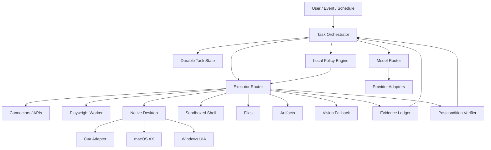

# Architecture

## Purpose

This document defines the target architecture for Lumi Agents.

The architecture is optimized for:

- local trust;
- replaceable models and execution engines;
- semantic automation before pixels;
- durable long-running work;
- verification;
- provider neutrality;
- measurable workflow outcomes.

## High-level system



## Trust boundary

Privileged local core:

- policy;
- executor gating;
- approval validation;
- secret resolution;
- device identity;
- evidence policy;
- verification;
- cancellation;
- update trust.

Lower-trust inputs:

- models;
- web pages;
- email/documents;
- plugins/MCP servers;
- Node/browser workers;
- third-party desktop drivers;
- vision models;
- remote orchestration.

Lower-trust components may propose or observe. They do not authorize.

## Core contracts

### ActionProposal

Conceptual fields:

- action_id;
- workflow_id;
- principal;
- capability;
- resource;
- target;
- arguments;
- expected_effect;
- risk_class;
- evidence_requirements;
- postconditions;
- idempotency_key.

### Observation

Represents structured state returned from connectors, browsers, desktop, files, shell, or artifacts.

Observations include provenance and timestamp.

### PolicyDecision

- ALLOW
- DENY
- REQUIRE_APPROVAL

### VerificationResult

- PASSED
- FAILED
- AMBIGUOUS
- NOT_REQUIRED

## Task lifecycle

```text
created
  -> planning
  -> executing
  -> awaiting_approval
  -> executing
  -> verifying
  -> completed | failed | ambiguous | cancelled
```

Long-running tasks persist state between transitions.

## Execution hierarchy

1. API/connector
2. browser semantic
3. native semantic
4. deterministic app adapter
5. vision/coordinates

The executor router may fall lower only when higher tiers are unavailable, insufficient, or measurably less reliable.

## Process boundaries

### Rust core

Owns:

- protocol;
- policy;
- orchestration state;
- approvals;
- secrets;
- audit;
- verification;
- model/executor routing;
- lifecycle;
- budgets;
- kill switch.

### Node Playwright worker

Owns:

- browser automation;
- locator evaluation;
- page observations;
- tracing;
- browser-context lifecycle.

It does not own policy or long-lived secrets.

### Desktop shell

Tauri UI owns presentation only:

- onboarding;
- approvals;
- task status;
- audit view;
- kill switch;
- updater UX.

It does not own policy.

## Local vs cloud

Lumi is hybrid.

Local is preferred for:

- credentials;
- employee app access;
- local files;
- policy enforcement;
- native UI automation;
- local-only inference;
- sensitive evidence.

Cloud is useful for:

- orchestration metadata;
- enterprise policy distribution;
- fleet visibility;
- hosted inference when permitted;
- event triggers;
- cross-device handoff.

Tenant policy defines allowed data egress.

## Engine replaceability

Workflow packs depend on Lumi contracts, never provider-specific or Cua-specific APIs.

Adapters translate between Lumi and:

- model providers;
- Cua;
- Playwright;
- direct native drivers;
- connectors;
- artifact engines.

This is the core durability rule.

## Target repository evolution

```text
apps/
  desktop/

crates/
  lumi-protocol/
  lumi-policy/
  lumi-runtime/
  lumi-state/
  lumi-audit/
  lumi-secrets/
  lumi-models/
  lumi-orchestrator/
  lumi-evals/
  lumi-artifacts/
  lumi-scheduler/

workers/
  playwright/

adapters/
  providers/
  executors/
  connectors/

packs/
fixtures/
docs/
```

Create modules when implementation requires them. The diagram is a destination, not a scaffolding checklist.


## Execution environment is a first-class identity

An **ExecutionEnvironment** is the machine/runtime that actually owns the work.

It owns or brokers:

- local filesystem state;
- authenticated browser/app sessions;
- local credentials and secret references;
- installed applications;
- provider instances that run locally;
- native permissions;
- runtime version;
- executor capabilities;
- local policy state.

Remote web/mobile/desktop supervisors control an environment through authenticated protocol. They do not substitute their own filesystem, credentials, or machine state for the environment's.

Every task records its execution-environment identity and a capability snapshot.

## Project is a first-class durable working context

Work mode uses the hierarchy:

```text
ExecutionEnvironment
  -> Project
      -> Task
          -> Run
              -> Action
```

A **Project** is a durable user-selected body of work rooted in one or more
authorized local filesystem roots on an ExecutionEnvironment.

It owns or references:

- stable Project identity;
- authorized roots and primary root;
- Project policy/configuration;
- discovered repository/build metadata;
- Git metadata when applicable;
- Project-scoped retrieval/index state;
- Project memory with provenance;
- durable Task history and Lumi change sets.

A Project is distinct from a task workspace. A Task may operate directly on the
Project root, a subdirectory, an isolated worktree, a temporary staging directory,
or a sandbox projection. The runtime records the concrete workspace and must not
silently switch scopes.

The Project root is the default filesystem authority boundary. Opening a Project
does not authorize sibling directories, home-directory secrets, SSH material,
browser profiles or unrelated repositories.

Repository content and project instruction files may guide work but cannot grant
capabilities or widen organization/user policy.

Normative behavior lives in
`docs/specs/v1/26-project-workspace-folder-as-project.md`.

## Automation is a durable task-creation resource

An **Automation** binds future triggers to bounded work:

```text
Automation
  -> Trigger
  -> Project / ExecutionEnvironment
  -> Task source
  -> Authority lease
  -> Task / Run
  -> History / Review Queue
```

The scheduler owns due-time/event admission, deduplication, overlap, catch-up,
retry/backoff and next-run calculation.

It does **not** own execution authority and does not bypass the orchestrator.

Every admitted Automation occurrence becomes the same durable Task/Run used by
interactive work. Actions still pass policy, approval, executor routing,
verification and evidence.

Automation definitions and run history are separate:

- definition = what/where/when/how much authority;
- run = exact occurrence, source/config hashes, effective policy, outcome and evidence.

Project-native Automations may reference versioned prompt/Skill files such as
`prompts/daily-ads-ops.md`. Repository content may alter instructions inside the
stored authority ceiling but cannot widen that ceiling.

Healthy silent runs still create history. Review/notification delivery is a
separate layer over execution.

Normative behavior lives in
`docs/specs/v1/13-scheduler-background-triggers.md`.

## Capability negotiation

Clients, control plane, and local runtimes may upgrade independently.

Compatibility is based on typed protocol version plus advertised capabilities, not optimistic version assumptions.

Examples of runtime capabilities:

```text
task_resume
task_fork
approval_digest_v1
browser_semantic
native_background_input
artifact_docx
provider_openai
provider_anthropic
provider_gemini
workflow_pack_v1
```

Missing capability means:

- hide or reject the operation;
- use an explicitly compatible fallback;
- never silently reinterpret it.

Persisted state must remain readable across supported upgrade/downgrade paths.

## Durable intent before side effects

For externally visible or otherwise consequential work, record durable intent before dispatch:

```text
normalize action
  -> persist intent + idempotency state
  -> authorize
  -> obtain approval when required
  -> execute
  -> persist execution result
  -> verify postcondition
  -> finalize outcome
```

An acknowledgment that intent is durable is not the same as successful execution.

External I/O should not be hidden inside the same persistence transaction that records intent.

The system must survive a crash between any two steps without blindly repeating an ambiguous side effect.

## Canonical execution outcomes

Executor transport success is not effect success.

Normalize action outcomes to:

- `DELIVERED` — required effect was independently observed;
- `REFUSED` — executor deliberately declined before mutation under a known contract;
- `NO_EFFECT` — action was attempted but the expected effect was not observed;
- `AMBIGUOUS` — the system cannot prove whether the effect occurred;
- `ERROR` — execution failed with a classified error;
- `CANCELLED` — cancelled before completion.

`REFUSED` can be the correct expected result in an eval.

An unproven capability is a gap, never implicit success.

## Supervised process isolation

Keep the privileged Rust core small.

Where practical, lower-trust or crash-prone engines run in supervised child processes with:

- deadlines;
- cancellation;
- bounded IPC;
- explicit capability negotiation;
- restart policy;
- structured errors.

Candidates include:

- Playwright/browser workers;
- Cua Driver;
- MCP/plugin bridges;
- future native helpers;
- model/provider helper processes.

A stalled or crashed executor should not take down policy, task state, or the desktop control surface.

## Task lifecycle

Long-running work uses the lifecycle defined in `docs/specs/task-lifecycle-v0.md`.

The architecture treats create, resume, fork, steer, pause, cancel, checkpoint, and archive as protocol operations rather than prompt conventions.

Task resources and attachments are stored separately from model transcript/context where practical.
