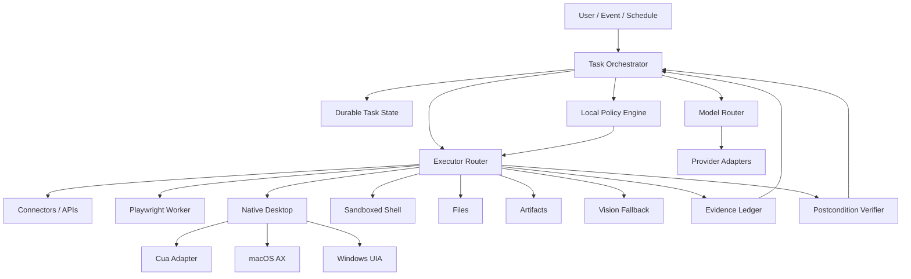

# Architecture

## Purpose

This document defines the target architecture for Lumi Agents.

The architecture is optimized for:

- local trust;
- replaceable models and execution engines;
- semantic automation before pixels;
- durable long-running work;
- verification;
- provider neutrality;
- measurable workflow outcomes.

## High-level system



## Trust boundary

Privileged local core:

- policy;
- executor gating;
- approval validation;
- secret resolution;
- device identity;
- evidence policy;
- verification;
- cancellation;
- update trust.

Lower-trust inputs:

- models;
- web pages;
- email/documents;
- plugins/MCP servers;
- Node/browser workers;
- third-party desktop drivers;
- vision models;
- remote orchestration.

Lower-trust components may propose or observe. They do not authorize.

## Core contracts

### ActionProposal

Conceptual fields:

- action_id;
- workflow_id;
- principal;
- capability;
- resource;
- target;
- arguments;
- expected_effect;
- risk_class;
- evidence_requirements;
- postconditions;
- idempotency_key.

### Observation

Represents structured state returned from connectors, browsers, desktop, files, shell, or artifacts.

Observations include provenance and timestamp.

### PolicyDecision

- ALLOW
- DENY
- REQUIRE_APPROVAL

### VerificationResult

- PASSED
- FAILED
- AMBIGUOUS
- NOT_REQUIRED

## Task lifecycle

```text
created
  -> planning
  -> executing
  -> awaiting_approval
  -> executing
  -> verifying
  -> completed | failed | ambiguous | cancelled
```

Long-running tasks persist state between transitions.

## Execution hierarchy

1. API/connector
2. browser semantic
3. native semantic
4. deterministic app adapter
5. vision/coordinates

The executor router may fall lower only when higher tiers are unavailable, insufficient, or measurably less reliable.

## Process boundaries

### Rust core

Owns:

- protocol;
- policy;
- orchestration state;
- approvals;
- secrets;
- audit;
- verification;
- model/executor routing;
- lifecycle;
- budgets;
- kill switch.

### Node Playwright worker

Owns:

- browser automation;
- locator evaluation;
- page observations;
- tracing;
- browser-context lifecycle.

It does not own policy or long-lived secrets.

### Desktop shell

Tauri UI owns presentation only:

- onboarding;
- approvals;
- task status;
- audit view;
- kill switch;
- updater UX.

It does not own policy.

## Local vs cloud

Lumi is hybrid.

Local is preferred for:

- credentials;
- employee app access;
- local files;
- policy enforcement;
- native UI automation;
- local-only inference;
- sensitive evidence.

Cloud is useful for:

- orchestration metadata;
- enterprise policy distribution;
- fleet visibility;
- hosted inference when permitted;
- event triggers;
- cross-device handoff.

Tenant policy defines allowed data egress.

## Engine replaceability

Workflow packs depend on Lumi contracts, never provider-specific or Cua-specific APIs.

Adapters translate between Lumi and:

- model providers;
- Cua;
- Playwright;
- direct native drivers;
- connectors;
- artifact engines.

This is the core durability rule.

## Target repository evolution

```text
apps/
  desktop/

crates/
  lumi-protocol/
  lumi-policy/
  lumi-runtime/
  lumi-state/
  lumi-audit/
  lumi-secrets/
  lumi-models/
  lumi-orchestrator/
  lumi-evals/
  lumi-artifacts/
  lumi-scheduler/

workers/
  playwright/

adapters/
  providers/
  executors/
  connectors/

packs/
fixtures/
docs/
```

Create modules when implementation requires them. The diagram is a destination, not a scaffolding checklist.
