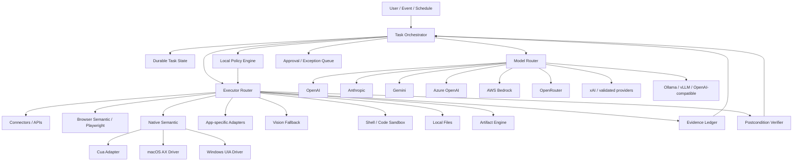

# Lumi Agents: Full-Scale Product & Engineering Roadmap

## Executive thesis

Lumi Agents should become a best-in-class agentic work platform for real computer work, while staying structurally different from generic model-native agents.

The durable product is not "an AI that can click."

The durable product is:

> A trusted execution operating system for knowledge work.

Models reason.

Lumi governs.

Lumi chooses the safest execution surface.

Lumi acts.

Lumi verifies.

Lumi records evidence.

Humans handle judgment, relationships, ambiguity, and consequential approvals.

The strategic moat is:

- workflow knowledge;
- business context;
- provider-neutral orchestration;
- execution hierarchy;
- local policy;
- approvals;
- secrets isolation;
- verification;
- evidence/replay;
- reusable skills and workflow packs;
- deployment/fleet trust;
- evals and reliability data;
- measurable workflow economics.

## North star

A user should be able to give Lumi a substantial task in natural language, leave it working across files, browser, shell, connectors, and desktop applications, then return to:

- a finished result;
- a concise explanation;
- inspectable evidence;
- clear exceptions;
- no unexpected side effects.

For recurring operations, Lumi should be able to perform the same workflow repeatedly with deterministic reliability and improving economics.

Primary metric:

```text
cost_per_verified_successful_workflow
```

Supporting metrics:

- verified task completion;
- unexpected intervention rate;
- time to verified completion;
- variable runtime cost;
- cost-center minutes displaced;
- reusable workflow-pack ratio;
- customer-specific engineering hours per deployment.

## Product modes

Lumi should support two complementary modes on one runtime.

### 1. Work mode

General-purpose knowledge work:

- research;
- local files;
- shell/code;
- web/browser;
- email/calendar/connectors;
- document/spreadsheet/presentation generation;
- data transformation;
- multi-step administrative tasks;
- long-running tasks;
- collaborative handoff.

This is the broad "agentic coworker" experience.

### 2. Workflow mode

Hardened repeatable business operations:

- quote/order intake;
- reconciliation;
- reporting;
- CRM/ERP updates;
- follow-up operations;
- monitoring;
- document processing;
- exception routing;
- vertical workflow packs.

This is the cost-center replacement engine.

Work mode discovers and prototypes.

Workflow mode hardens, governs, measures, and repeats.

The two modes should share protocol, policy, tools, provider routing, evidence, and execution engines.

## Non-goals

Do not:

- race model vendors on generic intelligence;
- rebuild every commodity computer-use primitive;
- use vision when semantics exist;
- ship an enormous plugin marketplace before trust boundaries are mature;
- make multi-agent orchestration the default;
- centralize customer credentials in prompts;
- confuse auditability with employee surveillance;
- claim workflow replacement before measuring residual human work;
- build an enterprise control plane before the local runtime earns trust.

## Architecture



## Trust architecture

Authority and advice must be separated.

Lower-trust:

- models;
- websites;
- email/documents;
- MCP servers;
- plugins;
- Node workers;
- vision models;
- third-party drivers;
- remote orchestrators.

Privileged local core:

- policy;
- executor gate;
- secret broker;
- approval verification;
- device identity;
- evidence policy;
- verifier;
- kill switch;
- update trust.

A compromised model or web page must not be able to grant itself more power.

## Execution hierarchy

Default:

1. connector/API;
2. browser DOM/accessibility;
3. native semantic automation;
4. deterministic app adapter;
5. vision/coordinate fallback.

Additional execution surfaces:

- shell/code sandbox;
- local filesystem;
- artifact generation.

The orchestrator chooses the least fragile surface that satisfies the task and policy.

## Provider-neutral model layer

### Core rule

The runtime API must describe capabilities, not vendors.

Suggested capability contract:

```text
ModelCapabilities
- text
- reasoning
- vision
- tools
- structured_output
- embeddings
- native_computer_use
- streaming
- long_context
- local_execution
- data_regions
- max_context
- tool_parallelism
```

### Provider adapter roadmap

Tier 1:
- OpenAI
- Anthropic
- Gemini

Tier 2:
- Azure OpenAI
- AWS Bedrock
- OpenRouter
- xAI/Grok after contract validation
- generic OpenAI-compatible endpoints

Local/on-prem:
- Ollama
- vLLM
- validated enterprise inference endpoints

### Routing policy

Route in this order:

1. tenant data policy;
2. local/cloud constraint;
3. provider allowlist;
4. region/data residency;
5. required capabilities;
6. historical workflow success;
7. latency;
8. cost per verified success;
9. remaining budget.

Never silently weaken privacy policy on fallback.

### Model roles

Do not use the most expensive model for everything.

Potential roles:

- planner/reasoner;
- fast extraction/classification;
- vision grounding;
- verifier/critic;
- embeddings/retrieval;
- code generation;
- summarization.

A strong model may plan while deterministic executors perform most actions.

## Context architecture

Separate four stores.

### Working context

Short-lived task state:

- current goal;
- plan;
- observations;
- tool results;
- pending approvals;
- checkpoints.

### Durable memory

Explicitly retained user/org knowledge with provenance and lifecycle.

### Workflow state

Durable resumable machine state:

- step;
- idempotency keys;
- retries;
- side effects;
- checkpoints;
- exception state.

### Evidence/audit

Immutable or tamper-evident record for actions and verification.

Do not merge these into one giant "memory".

## Long-running and resumable work

A real work agent must survive:

- app restarts;
- model/provider errors;
- network loss;
- user interruption;
- machine sleep;
- approval delays;
- external system latency.

Required primitives:

- durable task IDs;
- step state machine;
- checkpoints;
- idempotency keys;
- retry classes;
- timeout/deadline;
- action budget;
- model budget;
- cancellation tokens;
- human exception queue;
- ambiguous-side-effect handling.

Never repeat a side effect after crash without first determining whether it already succeeded.

## Background work and triggers

Eventually support:

- schedules;
- file/folder changes;
- webhook/events;
- inbox/queue triggers;
- connector events;
- device-local triggers.

Background execution requires:

- explicit policy;
- visible status;
- local kill switch;
- bounded runtime;
- rate/cost budget;
- audit;
- revocable server-side lease.

## Browser

Playwright is Plan A.

The browser process should be lower privilege than the Rust policy core.

Use semantic locators and accessibility information.

Persist browser traces for test failures, not by default for production user surveillance.

Authenticated profile attachment must be explicit and policy-controlled.

## Native desktop

### Now

Use a Lumi-owned DesktopDriver interface backed by pinned Cua Driver.

### Later

Build direct macOS AX and Windows UIA drivers only after paid usage proves strategic value.

### Direct driver success criteria

Build/expand only if direct ownership materially improves:

- reliability;
- security hooks;
- background execution;
- evidence;
- latency;
- platform coverage;
- cost;
- upstream independence.

## Shell and code execution

General knowledge work requires code execution.

Default model:

- sandboxed workspace;
- explicit filesystem root;
- network policy;
- command timeout;
- resource limits;
- no arbitrary credential inheritance;
- stdout/stderr captured;
- artifacts exported explicitly.

For employee-device workflows, prefer isolated workspaces over unrestricted host shell.

## Files

File operations need semantic policy:

- read;
- create;
- edit;
- move;
- delete;
- export/share.

Sensitive directories can be denied or approval-gated.

Every destructive file action should be reversible where feasible.

## Artifacts

First-class artifact types:

- markdown/text;
- PDF;
- DOCX;
- XLSX/CSV;
- PPTX;
- images;
- code repositories;
- reports/dashboards.

Artifact pipeline should record:

- input sources;
- generator/model;
- validations;
- version;
- owner;
- review/publication state.

Drafting and external publication/send are separate actions.

## Skills and workflow packs

### Skill

Reusable capability/instructions, usually task-oriented and less rigid.

### Workflow pack

Versioned production automation with:

- schema;
- inputs/outputs;
- permissions;
- execution hierarchy;
- policies;
- postconditions;
- exceptions;
- evidence;
- evals;
- economic baseline;
- supported app/OS versions.

Work-mode successes should be candidates for conversion into workflow packs.

## Multi-agent/subagents

Default: one capable orchestrator plus deterministic tools.

Use subagents when they provide measurable benefit:

- parallel independent research;
- independent verification;
- isolated code review;
- partitioned artifact generation;
- parallel browser tasks with independent state.

Avoid "agent swarms" as architecture decoration.

Any subagent has:

- scoped context;
- scoped capabilities;
- scoped budget;
- bounded output contract.

## MCP and plugin ecosystem

MCP is an integration protocol, not a trust boundary.

Lumi should support MCP/connectors through a capability registry.

Each integration declares:

- origin;
- version;
- license;
- tools/capabilities;
- side effects;
- network destinations;
- secret requirements;
- filesystem access;
- tenant policy compatibility.

Side-effecting calls still pass Lumi policy.

## Collaboration and handoff UX

A task should expose:

- goal;
- current plan;
- progress;
- pending approvals;
- exceptions;
- artifacts;
- sources/evidence;
- cost/time;
- final result.

Users should be able to:

- pause;
- redirect;
- approve/reject;
- inspect;
- take over;
- resume;
- hand off to another person/agent.

The UX should feel like delegating to a strong colleague, not watching a cursor.

## Desktop application

Tauri enters in the 30-90 day phase.

Desktop responsibilities:

- onboarding;
- permission status;
- tray/menu;
- task status;
- approvals;
- exception queue;
- local kill switch;
- privacy indicators;
- audit viewer;
- provider settings;
- updater;
- device identity.

The UI does not own policy.

## Distribution

macOS:

- signed;
- notarized;
- stable bundle identity for TCC;
- permission onboarding;
- signed updater.

Windows:

- code-signed installer/app;
- stable publisher identity;
- UIA tested on supported session types;
- signed updater.

Enterprise:

- MDM-friendly install;
- device registration;
- revocation;
- signed organization policies;
- update rings;
- proxy/network compatibility;
- data-egress controls.

## Security model

Mandatory protections:

- deny-by-default policy;
- scoped capabilities;
- action-bound approval;
- prompt-injection isolation;
- secret references;
- data-egress policy;
- per-action audit;
- postcondition verification;
- signed updates;
- dependency provenance;
- local stop;
- remote revocation;
- least privilege.

High-risk categories:

- financial;
- legal/consent;
- destructive;
- admin/security;
- sensitive exports;
- external communications.

Default to human approval until a narrow policy explicitly pre-authorizes the action.

## Evidence

Prefer structured evidence.

Examples:

- before/after values;
- record IDs;
- file hashes;
- policy decision;
- verifier result;
- selective screenshot.

Do not continuously record employee screens by default.

## Evals

### Dimensions

- verified completion;
- unauthorized side effects;
- human rescue;
- expected approvals;
- action count;
- latency;
- cost;
- provider;
- execution tier;
- retry/recovery;
- postconditions;
- prompt injection;
- OS/app version;
- privacy behavior;
- update/rollback.

### Matrices

Maintain:

- OS matrix;
- app/version matrix;
- browser matrix;
- provider/model matrix;
- workflow-pack matrix;
- security/adversarial corpus.

### Failure corpus

Every escaped production failure becomes a regression case when reproducible.

### Release SLOs

Internal alpha:
- 30+ runs/workflow;
- 90%+ verified completion;
- zero unauthorized side effects.

Customer pilot:
- 100+ representative runs/workflow;
- 95%+ verified completion;
- <5% unexpected human rescue on hardened routine path;
- zero policy bypasses.

Hardened narrow workflows:
- target 99%+ on explicitly certified matrices.

Consequential actions may still require human approval regardless of technical reliability.

## Economics

Measure:

```text
monthly_gross_labor_value
= runs_per_month
* (baseline_minutes - residual_human_minutes) / 60
* loaded_labor_cost_per_hour

monthly_net_value
= monthly_gross_labor_value
- runtime_variable_cost
- support_cost

simple_payback_months
= implementation_cost / monthly_net_value
```

Optimize model/provider routing around verified successful workflow economics, not cheap tokens.

Hypothesis for initial paid pilots:

- target simple payback <= 6 months when feasible;
- runtime variable cost < 10% of measured gross labor value released;
- automation should meaningfully reduce human touches or cycle time.

These are decision heuristics, not marketing guarantees.

## Open-core boundary

Recommended open Apache-2.0 core:

- protocol;
- policy;
- local runtime;
- public SDK;
- driver interfaces;
- baseline provider adapters;
- workflow-pack schema.

Potential proprietary/commercial layers:

- enterprise control plane;
- managed fleet;
- organization policy console;
- premium workflow packs;
- vertical IP;
- deployment services;
- hosted analytics/ROI intelligence;
- proprietary customer adaptations.

The open core should be useful independently and auditable enough to earn trust.

## Repository target structure

```text
apps/
  desktop/

crates/
  lumi-protocol/
  lumi-policy/
  lumi-runtime/
  lumi-state/
  lumi-audit/
  lumi-secrets/
  lumi-models/
  lumi-orchestrator/
  lumi-evals/
  lumi-artifacts/
  lumi-scheduler/

workers/
  playwright/

adapters/
  executors/
    cua/
    macos-ax/
    windows-uia/
  providers/
    openai/
    anthropic/
    gemini/
    azure-openai/
    bedrock/
    openrouter/
    xai/
    openai-compatible/
  connectors/

packs/
  ...

fixtures/
  ...

docs/
  roadmap.md
  architecture.md
  security-model.md
  model-providers.md
  workflow-packs.md
  licensing.md
```

Do not create every directory before code requires it. This is a target map, not permission for empty-framework sprawl.

# Roadmap

## Phase 0: next 7 days

Goal: turn the architecture into one vertical slice.

1. stabilize Action/Observation Protocol v0;
2. implement policy decisions and scoped approval token shape;
3. create audit event + postcondition verifier interfaces;
4. implement Playwright worker skeleton with deterministic fixture;
5. implement Cua adapter skeleton with exact version/checksum config;
6. implement one provider adapter + provider capability contract;
7. choose one real workflow and run it repeatedly.

Definition of success:

- one workflow goes from real-like input to verified result;
- every side effect passes local policy;
- failed verifier cannot report success;
- evidence exists;
- runtime cost and latency recorded.

Do not start desktop polish before this.

## Phase 1: 0-30 days

Goal: prove the execution kernel across three valuable workflows.

Build:

- protocol v0;
- local policy;
- scoped approvals;
- audit ledger;
- postcondition verifier;
- secret references/broker;
- Playwright worker;
- Cua native adapter;
- OpenAI adapter;
- Anthropic adapter;
- Gemini adapter;
- OpenAI-compatible/Ollama adapter;
- CLI task runner;
- durable task state;
- deterministic fixtures;
- three cost-center workflow packs.

Candidate archetypes:

1. quote/order intake;
2. reconciliation/data transfer;
3. recurring operational reporting.

Gate:

- >=30 repeated runs per workflow;
- >=90% verified completion in controlled alpha;
- 0 unauthorized side effects;
- failure taxonomy for every failed run;
- measured before/after labor and cycle-time baseline.

Stop/change:

- if browser/API covers the paid workflow, do not add native complexity;
- if raw vision dominates, build semantic/app adapter or narrow scope;
- if economics are weak, reject the workflow.

## Phase 2: 30-90 days

Goal: employee-ready customer alpha.

Build:

- Tauri desktop shell;
- permission onboarding;
- task status;
- approval UX;
- exception queue;
- local kill switch;
- audit viewer;
- Keychain/Windows secret storage;
- signed updater;
- signed/notarized macOS canary;
- signed Windows canary;
- crash-safe resume;
- provider router;
- Ollama/local model support;
- prompt-injection corpus;
- adversarial policy evals;
- basic scheduler/background runner;
- artifact generation pipeline;
- first direct macOS AX and Windows UIA prototypes.

Gate:

- >=100 representative runs per certified workflow;
- >=95% verified completion;
- <5% unexpected human rescue on mature routine path;
- zero authorization bypass;
- tested upgrade and rollback;
- every external build signed;
- recovery from restart/network/provider failure demonstrated.

## Phase 3: 3-6 months

Goal: become a platform, not an automation consultancy.

Build:

- workflow-pack SDK;
- pack versioning;
- pack eval registry;
- organization policy distribution;
- MDM-friendly deployment;
- device identity/revocation;
- model routing by reliability/cost;
- provider adapters for Azure OpenAI, Bedrock, OpenRouter, validated xAI path;
- app-specific adapters where ROI justifies;
- privacy/data-region controls;
- artifact review/publication flow;
- event triggers;
- collaboration/handoff;
- control-plane API boundary;
- Cua-vs-native benchmark.

Commercial gate:

- 5-10 hardened packs in chosen verticals;
- third deployment of same pack <1 engineering day;
- tenth deployment <4 engineering hours;
- >=70% workflow logic reused;
- positive unit economics after support.

## Phase 4: 6-12 months

Goal: general-purpose agentic work without sacrificing workflow rigor.

Build:

- robust Work mode;
- local files + safe shell;
- research and browser tasks;
- document/spreadsheet/presentation workflows;
- long-running projects;
- scheduled/background tasks;
- resumable multi-session work;
- richer memory/context controls;
- optional subagents;
- connector/plugin SDK;
- enterprise fleet dashboard;
- cross-device task handoff.

Gate:

- broad task benchmark with verified artifact quality;
- provider switching without workflow changes;
- stable task resume across application restarts;
- strong privacy/local-only mode;
- >99.9% policy engine availability locally;
- no single model/provider represents an architectural dependency.

## Phase 5: 12-18 months

Goal: defensible execution ecosystem.

Invest based on evidence in:

- production Lumi macOS semantic driver;
- production Lumi Windows semantic driver;
- specialist local vision/grounding;
- enterprise on-prem inference;
- signed organization policy management;
- workflow-pack marketplace/ecosystem;
- opt-in privacy-preserving trajectory learning;
- application/version certification;
- automatic workflow hardening from successful Work-mode trajectories;
- richer organizational memory and governance.

Do not build all of these. Usage decides.

## 18+ months

North star:

Lumi becomes the trusted work execution layer across employee computers, cloud apps, local files, business systems, and model providers.

A company should be able to describe a business process, prove it with human examples, let Lumi learn the safe routine path, certify it, then run it repeatedly with measurable economics and human exception handling.

# Moat

Commodity:
- cursor movement;
- screenshots;
- generic prompting;
- basic model access;
- simple browser clicks;
- basic MCP plumbing.

Own:
- workflow economics;
- workflow-pack corpus;
- business context graph;
- local policy;
- approvals;
- secrets;
- verification;
- evidence/replay;
- reliability data;
- device trust;
- deployment;
- app adapters for valuable systems;
- exception-handling patterns;
- cross-provider routing from measured task outcomes.

# Strongest argument against building this

The strongest objection is that frontier providers and open-source runtimes may commoditize local computer use so quickly that maintaining Lumi's own desktop runtime becomes wasteful.

The answer is not to outbuild them.

The answer is to keep engines replaceable and own the workflow/business/security layers above them.

Stop building native infrastructure if upstream runtimes meet reliability, security-hook, and deployment needs.

# Load-bearing assumptions

1. Businesses have repetitive knowledge-work cost centers large enough to justify implementation.
2. Semantic automation can cover most high-value routine steps.
3. Local policy/evidence materially improves enterprise trust and adoption.
4. Customers value provider flexibility and local/on-prem options.
5. Successful customer implementations can become reusable workflow packs.
6. Model quality continues improving faster than workflow requirements expand.

# Cheapest falsification tests

- 3 paid workflows, 30 repeated runs each;
- compare API/browser-only vs native automation coverage;
- switch same workflow between two model providers with no business-logic changes;
- simulate prompt injection and verify policy cannot be expanded;
- crash midway after a side effect and prove resume avoids duplication;
- deploy same workflow pack to a second customer and measure reuse hours;
- run local-only mode and prove no cloud egress.

# Stop criteria

Pause or reject a workflow if:

- economics are weak;
- exception rate dominates;
- postconditions cannot verify success;
- risk cannot be bounded;
- API integration is safer/cheaper;
- visual-only interaction is too fragile for the consequence;
- deployment/privacy cost exceeds labor savings.

Technical feasibility alone is not a reason to automate.

# Quality bar

We are not trying to ship the most features.

We are trying to make delegating real work feel boringly reliable.

That means:

- fewer surprises;
- fewer unnecessary approvals;
- faster recovery;
- visible progress;
- excellent artifacts;
- strong defaults;
- graceful failure;
- provider freedom;
- clear evidence;
- measurable value.

Insanely great or nothing means we remove anything that makes the product less trustworthy, less simple, or less useful, even if that thing looks impressive in a demo.
